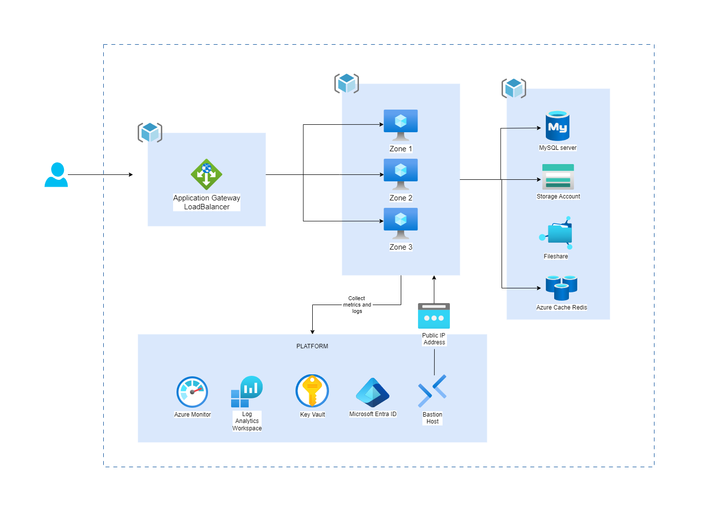
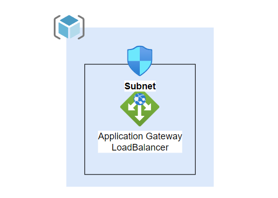
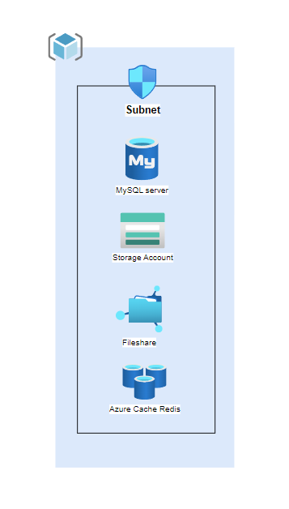
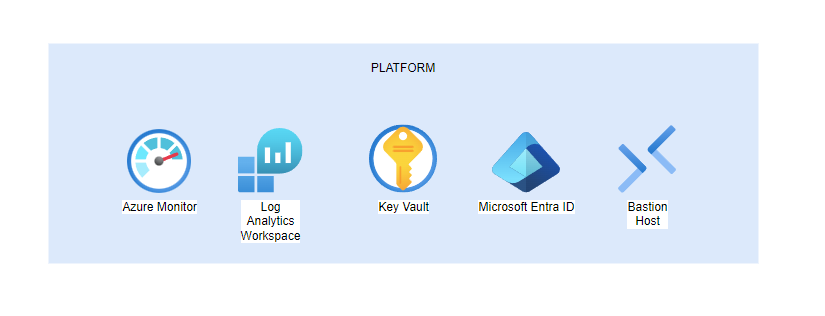

# Multi Zone Infrastructure deployment in Azure

This architecture explains the connectivity of client to server using application gateway which is a best practice and a secure way of routing traffic to the web application. Using subnets in most of grouped resources, will let traffic flow in between VM and update the data by calling it from VM.

Availability zones are physically separated collections of datacenters in a given region. Deploying resources across zones ensures that outages that are limited to a zone dont affect the availability of your applications

These zones can map to different physical locations for different subscriptions. The architecture is only represeting a single subscription deployment.

## Architecture

## Components - Workflow

### Resource Groups

Azure Resource Groups are containers that hold related resources for an Azure solution. Allocating the resources in resource groups depends on what makes the most sense for the subscription/organization. Resources are grouped in a resource group depending on their relation/purpose e.g. (Network resources, Container resources, VMs, Databases - Storage resources etc..). As a good practice is used to deploy resources that share 'the same lifecycle' to create, update and delete them as a group.

### Virtual Network

Azure Virtual Network is a networking resource in Azure that builds the same fundamental block of internal network inside Azure subscription. Virtual network makes sure that Azure resources, on-prem communicate securely with each other. All resources that are part of a virtual network, by default can comunicate outbound with internet. Inbound communication to these isolated resources is possible by using Public IP Address or a public loadbalancer.

In this infrastructure are deployed multiple subnets which are serving to host devices (Azure resources) and give them an IP. Each type of networking resource here has it's own subnet (they are grouped in subnets also).

### Application Gateway

Azure Application Gateway Loadbalancer is a layer 7 type of loadbalancer which is recommended for routing traffic on web ports. It's deployed with WAF Sku which makes the web application that is deployed in VMs more secure. This loadbalancer based on implementation of the Core Rule Set (CRS) of the Open Web Application Security Project (OWASP), provides increased protection against common threats and vulnerabilities.

### Virtual Machines

Azure Virtual Machines are servers which are deployed as part of a specific subnet using NIC, it gives them a private ip which only application Gateway can have access on, depending on the backend port of application which is deployed in. Virtual Machines since are servers, they can have a variety of OS images installed. They use only compute power to run the backend and frontend functions.

### MySQL database - flexible server and Storage Account

Azure MySQL database flexible server is a managed relational database service of Azure. It's engine versions are based on the MySQL community edition versions. It can come into different locations.

Azure Storage Account is a storage resource in Azure which can contain all storage objects (blob, queue, tables, files). Azure provides high availability for this resource depending on the selection when it's created. This storage account comes also with it's unique endpoints that are available in public internet also, connection is possible through HTTP/HTTPS.

### Platform Services

Azure platform services play a critical role in securing, monitoring and managing infrastructure. Microsoft Entra ID is the backbone of IAM in Azure, it makes sure to securely authenticate and autherize users and applications and/or reosources. Azure Key Vault is essential for managing secrets, certificates and encryption keys. It allows applications to retrieve these credentials securely using managed identities. Azure Monitor provides observability into infrastructure and applications by collecting metrics, logs. Logs from various resources can be centralized in a Log Analytics Workspace that provides advanced query to troubleshoot resources. Azure Bastion Host eliminates the need for exposing virtual machines to public IPs by providing secure RDP and SSH access directly from the Azure portal.

## Scenario details

This architecture tries to follow the pillars of Azure Well-Architected Framework which is a set of quality-driven tenets, architectural decision points, and review tools intended to help solution architects build a technical foundation for their workloads.

## Potential use cases

Blogging or community forum website/platform

Media publishing website/platform

Digital library website/platform

## References

 - [Azure Zone Redundancy and availability zones](https://bulldogjob.com/news/449-how-to-write-a-good-readme-for-your-github-project)
 - [Cache asside pattern](https://learn.microsoft.com/en-us/azure/architecture/patterns/cache-aside)
 - [LAW and design](https://learn.microsoft.com/en-us/azure/azure-monitor/logs/workspace-design)