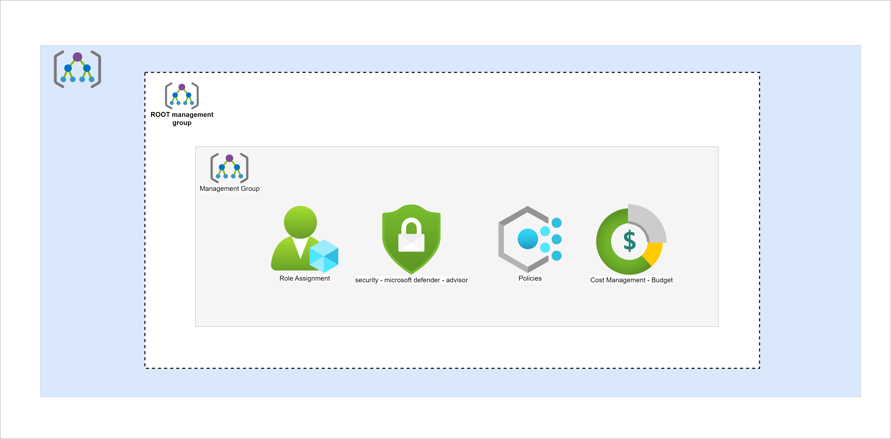
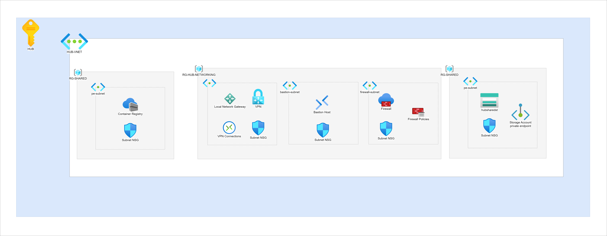

# Azure secured Multi-environments infrastructure - AKS - GitOps

This architecture defines a multi-environment infrastructure with Zero Trust security by following hub-and-spoke topology and separated into multiple Azure subscriptions for improved security and governance.

The application deployed within this infrastructure uses Azure AD B2C for authentication. It communicates with a REST API developed in Node.js which directs authentication requests to the appropriate Azure AD B2C tenant which enables secure user authentication and access to backend services.

Recommendation Engine Service built as a microservice continuously tracks user actions within the application. These actions are forwarded in real-time via a message broker (Azure Service Bus similar to RabbitMQ) allowing the Recommendation Engine to process user interactions and generate personalized suggestions.

Enhancing performance and providing an optimal user experience, this application leverages Azure Cache for Redis for temporary data storage by reducing database load and improving response times.

Since this infrastructure follows a Zero Trust security model there is a self-hosted VM agent that is used for CI/CD pipelines. This agent runs within a private network to facilitate containerization and deployment of the application in Azure Kubernetes Service (AKS) using GitOps for automated deployments.

# Architecture

# Components

## Management groups and hierarchy

Infrastructure is organized using Azure Management Groups which provides a structured way to manage policies, access control and governance across multiple subscriptions. Applying policies at the management group level all the associated subscriptions automatically inherit these configurations ensuring consistency, security, and compliance across environments.

There are some key policies to implement that will enforce zero trust security model

- Multi-Factor Authentication (MFA) is required for tenant administrators to enhance security.
- Backup protection prevents accidental deletions by enforcing retention policies.
- RBAC is used to manage resource access efficiently. Assigning roles at the management group level, those permissions are inherited by all linked subscriptionsw that makes more simple for IAM.

Budgets are set at the management group level to track and manage costs across multiple subscriptions.

Cost alerts are configured to notify teams when spending reaches predefined thresholds, this helps to prevent unexpected expenses.

Managing cloud resources efficiently is crucial for maintaining performance, security and cost-effectiveness. Time to use Azure Advisor. It provides proactive recommendations to

- Optimize performance and reliability of workloads, identify vulnerabilities and reduce unnecessary costs (optimizing resources)

## Hub and spoke topology

This hub environment contains the connectivity and security resources in Azure. All traffic entering the spoke network (prod) is routed through a route table to the firewall subnet where is filtered based on rules before reaching its designated endpoint / typically the AKS application.

Infrastructure follows the hub-and-spoke topology suggestion from Azure to route the traffic in between the networks. Using firewall to filter and let out traffic based on the firewall policies.

VPN Gateway is another way of connecting securely to this infrastructure from on-premise or outside users and is going to allow only the users of this tenant based on the groups/users that are assigned.

Container Registry is deployed in hub environment since it's considered as a shared resource. Make sure to be secured and the only way of delete/push images to this container registry is done through automated process. Access here is restricted based on the selected network ip address.

## Spoke (PROD) environment

Here is the environment where the application stands, more specific in this environment it's deployed AKS and networking resources that help to expose the application securely and make sure the low latency for all users that connect in this application.

Kubernetes cluster will have only one default nodepool that will be scalable based on the load.

ArgoCD will be used as one of the tools of GitOps model having it's own namespace where it's also exposed in private network. Credentials and confidential IDs are stored in Azure Key Vault and used when needed inside kubernetes cluster.

In the end it's deployed AGIC the ingress controller for Azure ApplicationGateway LoadBalancer that will automate the process of exposure and link of the records in the public DNS zone that is deployed in Azure by only following the rules and attributes suggested from Kubernetes for ingress. Application Gateway LoadBalancer will have WAF enabled.

CDN is deployed in the front of everything that manages the load of the traffic to the inside network of Azure infrastructure >> kubernetes cluster.

# Scenario details

This solution is based on hub-and-spoke network topology with zero trust security model. It ensures that all operations are automated with code and management is handled externally. Direct server management from within the environment is not permitted, reinforcing security.

## Potencial use cases

Microservices-based applications handling sensitive client data.

Media and streaming platforms.

High-traffic portals requiring frequent access.
## References

 - [Hub-and-spoke network topology](https://learn.microsoft.com/en-us/azure/architecture/networking/architecture/hub-spoke)
 - [Azure Landing Zone - CAF](https://learn.microsoft.com/en-us/azure/cloud-adoption-framework/ready/landing-zone/)
 - [Azure AD B2C](https://learn.microsoft.com/en-us/azure/active-directory-b2c/overview)

