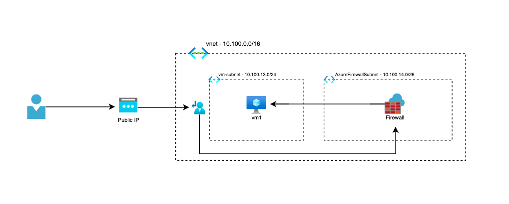
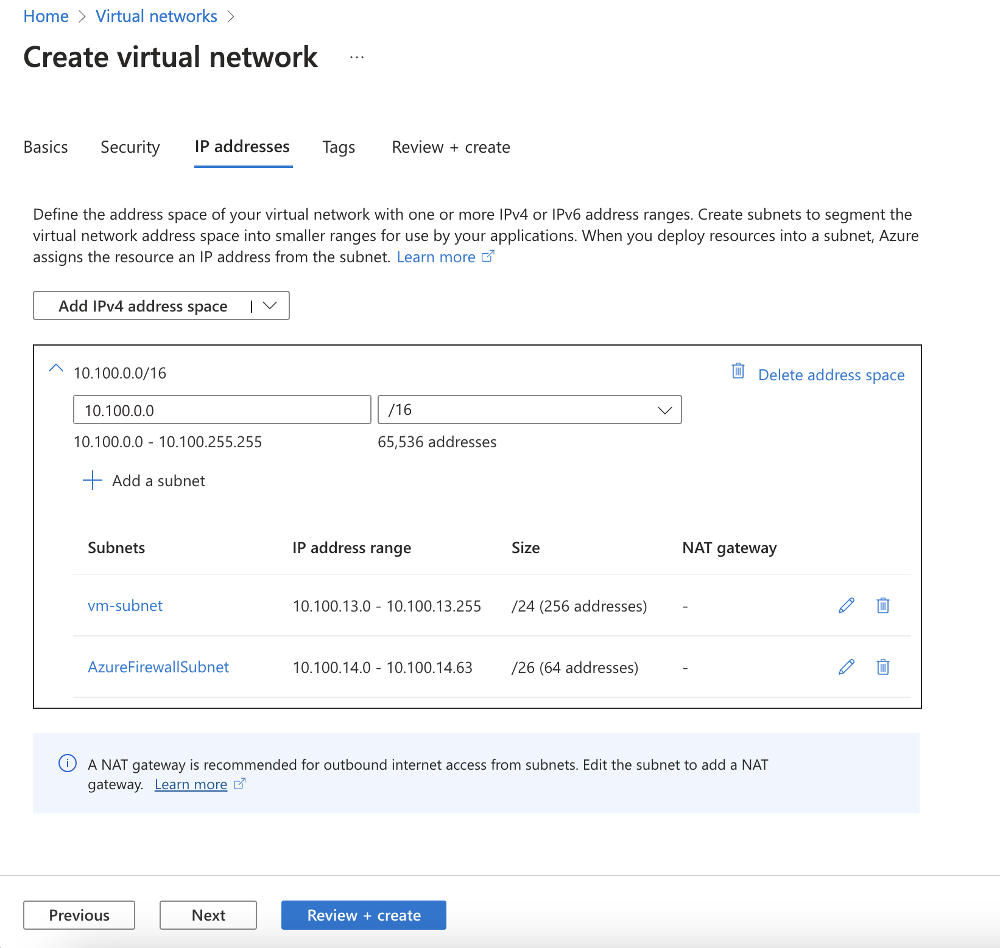
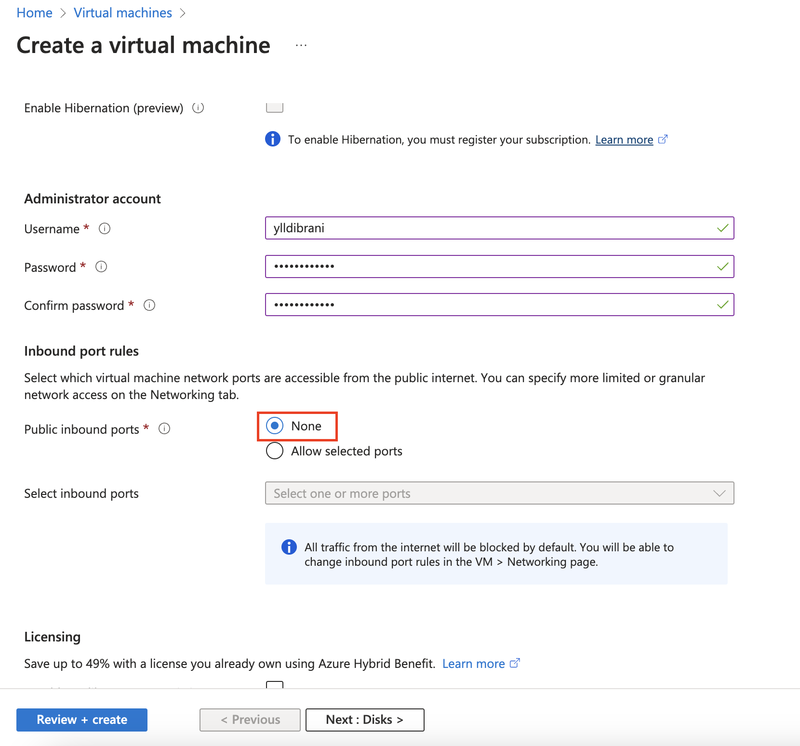
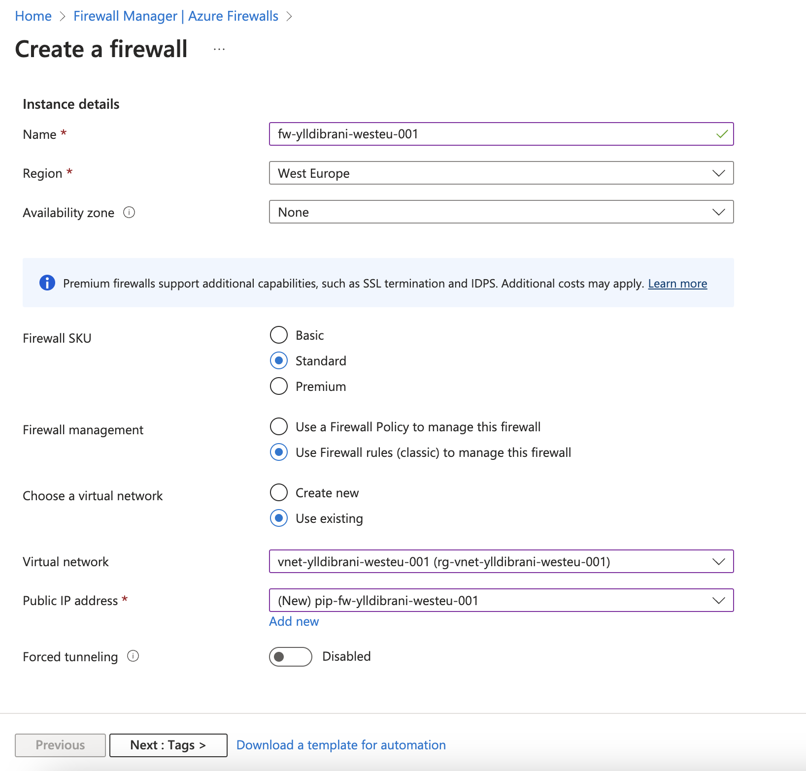
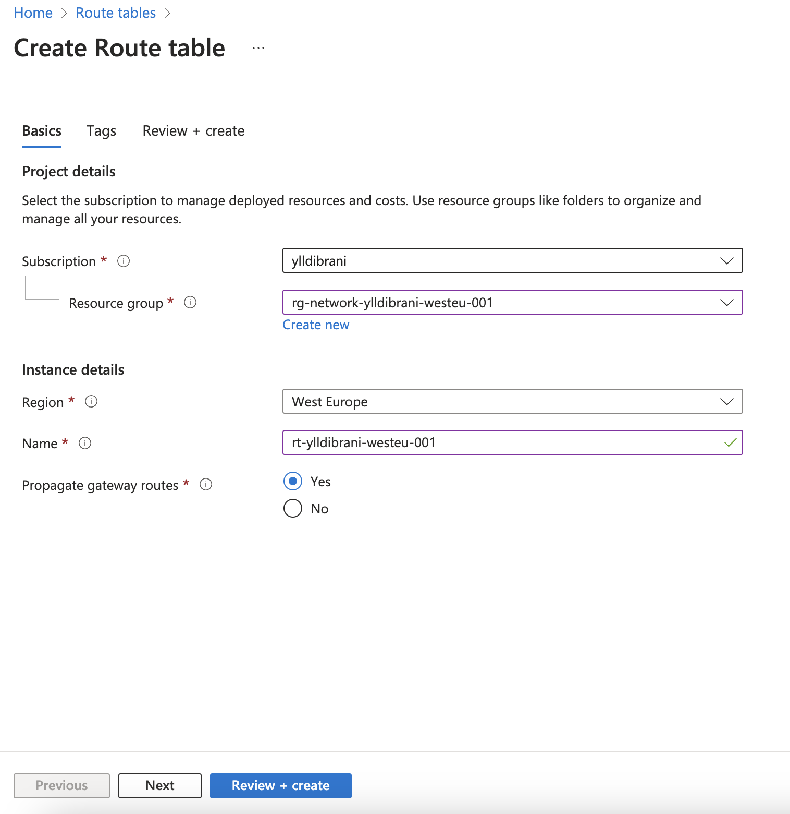
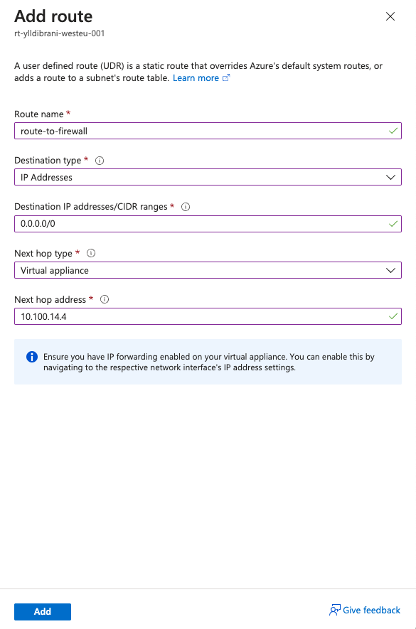
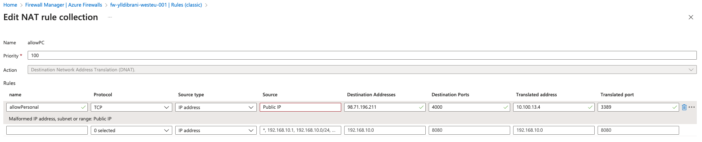
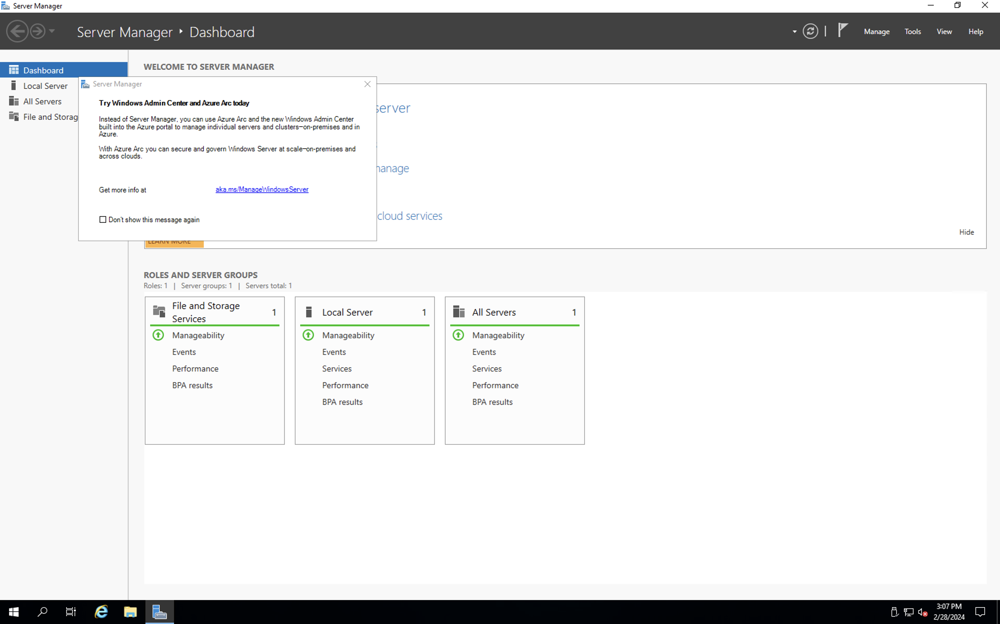
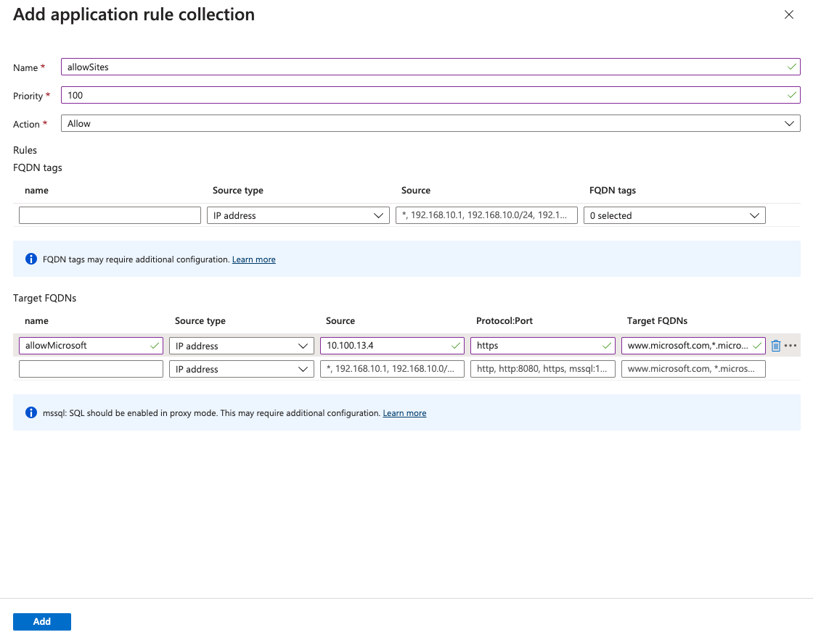

# Accessing private VM using Firewall

Let's create private VM and access it using Firewall by configuring NAT rules in Firewall, route-table, application rules to allow access to the internet from VM on specific sites.

 // diagram

## Create vnet & VM

First let's create vnet in Azure.

While we follow steps on creating vnet, here we create 2 subnets for VM & Firewall.

 // this sc shows creating vnet

Let's create VM, make sure to select None at Public inbound ports, this is not needed since we are going to connect through firewall public ip.

 // this sc shows creating VM, inbound port None

Next resource to create is firewall, we're going by Standard SKU for our case (depends on our needs) and also select the classic Firewall rules for more simple rule configuration.

 // this sc shows creating firewall, selecting classic firewall rules

Final step of creating resources is Route Table, configuration will be done afterwards.

 // this sc shows creating route table, leave default configurations

Let's start configuring stuffs !

First of all we have to route traffic from Subnet where VM is assigned to Firewall, this can be done by assigning this route table to the vm-subnet and add route from all traffic 0.0.0.0/0 to Firewall IP 10.100.14.4.

Don't forget to associate route table to vm-subnet !!! (go to RouteTable > Subnets > Associate, select subnet)

 // this sc shows creating route rule

Now we have to configure NAT rule to allow our public IP from our PC to Firewall in cloud, so in this way we can connect to VM by only our IP and selected port number that we want to assign.

Check attributes in the source we set our Public IP from where we want to access the VM, Destination Address is the Public IP of Firewall we can find it in Azure Firewall Overview dashboard, Destination Ports can be an custom port number we assign to connect to Firewall and then the Translated Address and Translated port stand for private IP of VM and the default port that is used for RDP 3389.

 // this sc shows creating firewall NAT rule to allow our public IP

Now we can connect to our VM by using PublicIP:4000 using RDP connection from our device.

 // this sc shows Windows server

We can access through Firewall Public IP but we don't have access to the internet and that's where the configuration of Application Rules collection is used.

On the Target FQDN's stage allow Microsoft website as is the default recommended one for this use case, protocol https and Target FQDNs are: www.microsoft.com,*.microsoft.com, make sure to use the Private IP of the VM as it's the source of the request from where it's made.

 // this sc shows creation of Application rule collection

Traffic to Target FQDNs is allowed from Firewall and accepted, it can be used in different use cases and different Target FQDNs depends on needs and rules.