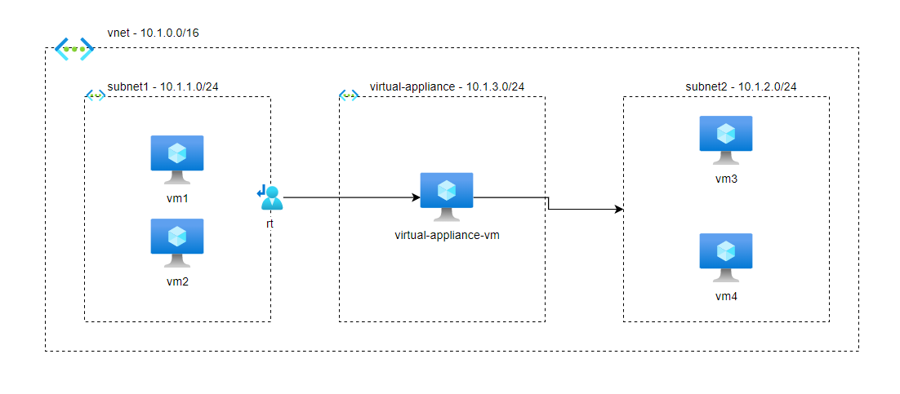
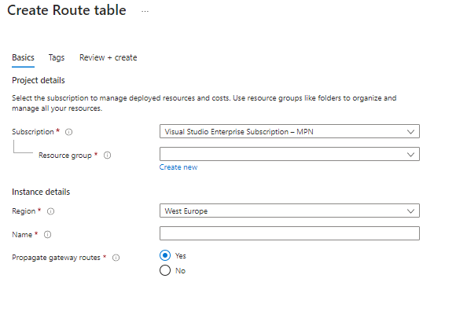
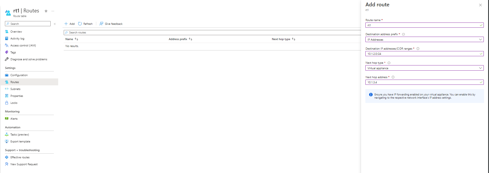

# Routing traffic using route table in Azure

We want to route traffic from subnet1 to subnet2 using route Virtual Appliance through VM (can be firewall vm, scan traffic etc...) into subnet2.

Based on diagram below we have one vnet with 3 subnets, all of them contain VM, notice one subnet is called Virtual Appliance subnet with only one VM, this VM will forward traffic to subnet2 VM's

What is a route table in Azure ?

Azure Route Tables (User Defined Routing), is a networking resource in Azure that allows us to create network within VNet or between VNet's from a subnet to other.

Let's configure our Route Table in Azure

First create Route Table in Azure

Choose resource group and add name

Propagate gateway routes is used when you have to Move On-premises routes to the network interfaces in associated subnets to Azure.

After deployment process is finished and Route Table is ready, go to Route Table created and select Routes.

Click Add to add a new rule.

Destination IP addresses/CIDR ranges - is the ip range of subnet where the traffic is going to be routed after it goes from Virtual Appliance VM so in this case we are going to route traffic from subnet1 to subnet2 and we add subnet2 ip range.

Next hop type - is the type of how the routing will be done, in this case we are using Virtual Appliance (firewall VM).

Next hop address - is the private ip address of the VM which will route traffic to subnet2 after accepts from subnet1.

Click Add and now the subnet1 traffic will route to VM firewall and then it will send it to subnet2.

Please also ensure the Virtual Appliance VM has IP forwarding enabled