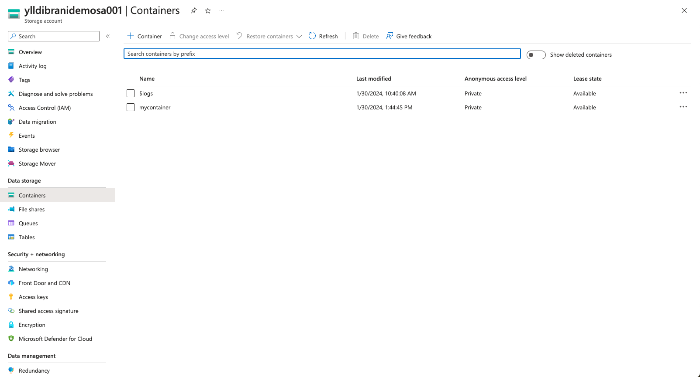
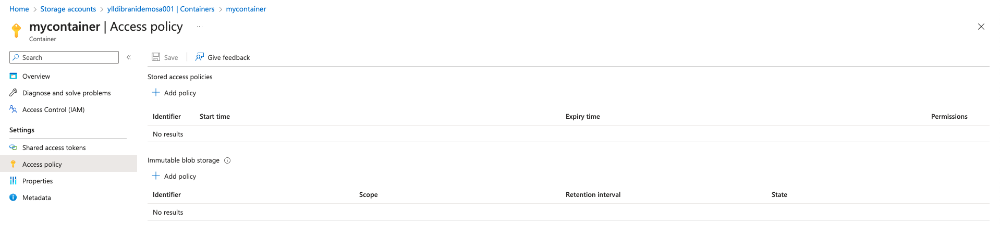

# Storage Account

Create Access Key policy for specific container and inherit permissions to SAS (Shared Access Signatures).

First step select Container we want to create the Access Key policy

Select Access policy and click Add policy under the 'Stored access policies'.

Add an value as name on 'Identifier *' box and select permissions in the dropdown menu, in this case we're checking Read & List boxes.
Since this is an Shared access token we should also select date from start time, to expiry time when these access tokens will expire using this policy.

Policy that we created is listed under 'Stored access policies'

Use the existing/created policy in Shared access token under 'Stored access policy' dropdown menu, select name of policy we created.

Generate SAS token and URL, copy results and ready for use !